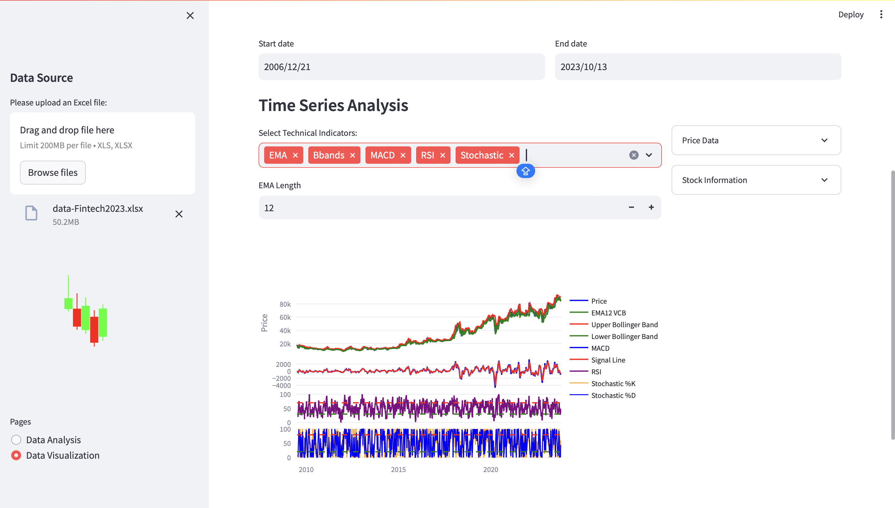
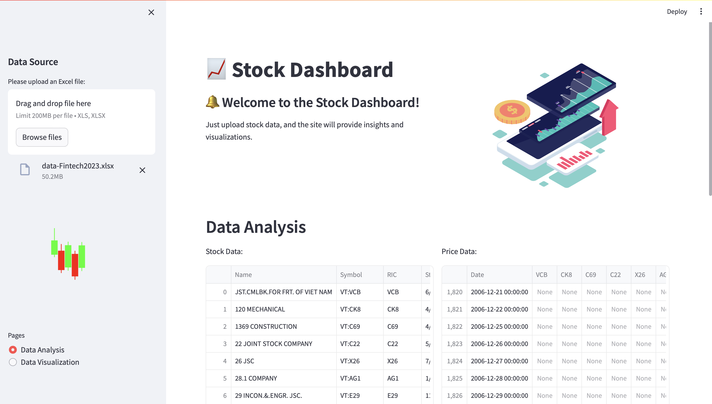

# Stock Dashboard 
### http://localhost:8501.
DATA: https://docs.google.com/spreadsheets/d/1wyXyZbCToVdzuFVtlCICyo9KxKtX9w5g/edit?usp=share_link&ouid=112575585036662129109&rtpof=true&sd=true.

## Project Overview

This project is a hands-on exercise in data visualization using a dashboard designed to visualize stock prices and technical analysis charts. The dashboard provides interactive visualizations to understand the financial performance and trends of companies.

## Features

### 1. Stock Price Chart
- **Description:** Displays historical stock prices of Masan Consumer Corporation and other selected stocks over a chosen date range.
- **Features:** Interactive date range selector, zooming, and panning.

### 2. Technical Analysis
- **Description:** Presents various technical indicators for analyzing stock price movements and trends.
- **Indicators:** Moving Averages (MA), Moving Average Convergence Divergence (MACD), Relative Strength Index (RSI), Bollinger Bands.

### 3. Interactive Elements
- **Features:** Toggle buttons for showing/hiding indicators, interactive plots.

## Screenshots

- Screenshot of the main dashboard view

- Screenshot of the technical analysis section.

## Acknowledgements

- **Course:** Financial Data Analysis and Visualization
- **University:** University of Economics and Laws
- **Contact:** For any questions or suggestions, please feel free to contact me at nhv.analysis@gmail.com.
